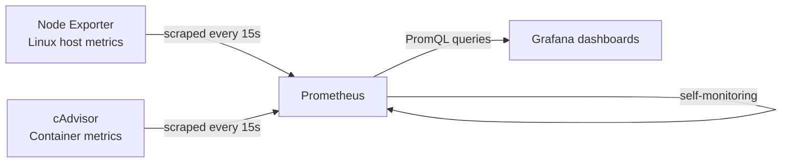
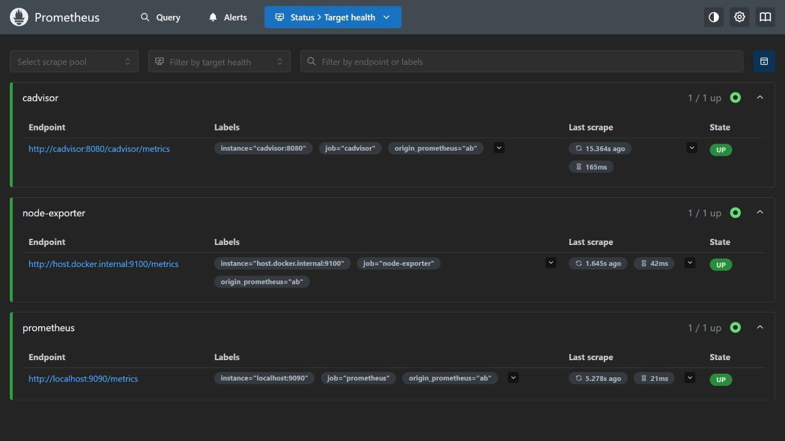
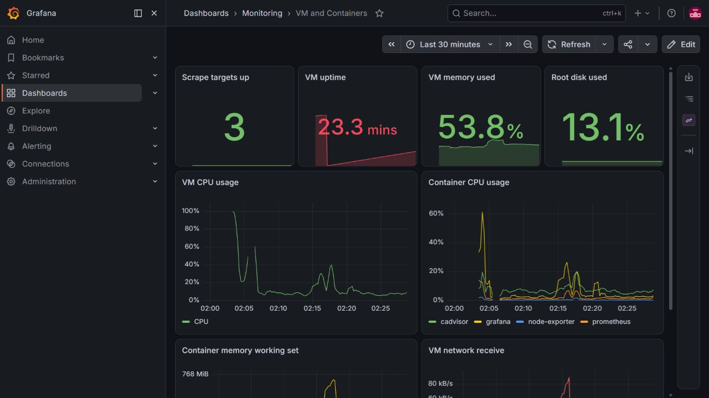
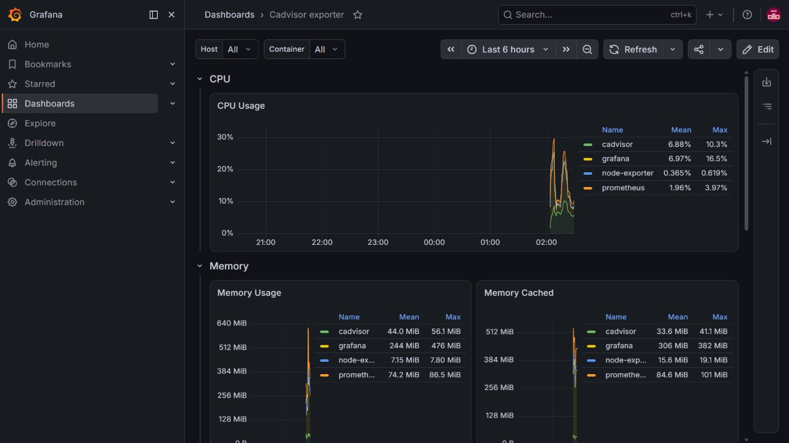
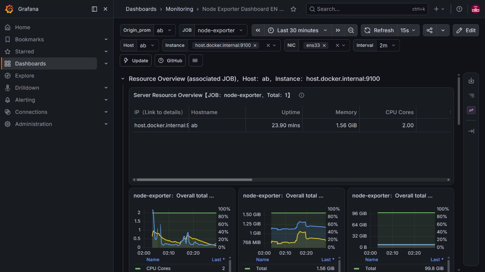

# Linux & Container Monitoring with Prometheus and Grafana

A monitoring lab running on an Ubuntu virtual machine, collecting host and container metrics with Prometheus, Node Exporter, and cAdvisor, alongside Grafana for visualization.

## Project overview

This project brings system and container metrics into a central monitoring service. Node Exporter exposes Linux host metrics, cAdvisor exposes container metrics, and Prometheus collects them every 15 seconds. Grafana runs alongside the collection layer to support dashboard-based exploration.

The running lab was inspected on **3 September 2026**. All three configured Prometheus targets were healthy, and queries returned host CPU, host memory, container CPU, and container memory metrics.

This portfolio includes two exported Grafana dashboards, a reviewed Prometheus configuration, import guidance, and validation evidence. The original VM deployment files still require SSH access, so a complete one-command deployment is not included.

## Architecture

## What I built

- An Ubuntu-based monitoring environment hosted in VMware Workstation.
- A Prometheus collection pipeline with separate jobs for Prometheus, Node Exporter, and cAdvisor.
- Host and container metric collection, providing the data needed to investigate resource use.
- A Grafana visualization layer with a focused **VM and Containers** dashboard, an integrated community **Node Exporter** dashboard, and a cAdvisor resource view.

## Dashboards

| Dashboard | What it shows |
| --- | --- |
| **VM and Containers** | Eight panels: healthy targets, VM uptime, memory use, root disk use, VM CPU, container CPU, container working-set memory, and incoming network traffic |
| **cAdvisor Exporter** | CPU, memory, cache, and network metrics for the Grafana, Prometheus, Node Exporter, and cAdvisor containers |
| **Node Exporter** | Detailed host overview with CPU, memory, disk, network, system load, and file-descriptor panels; filters for host, instance, and network interface |

The Node Exporter dashboard is based on [StarsL.cn's community dashboard 11074](https://grafana.com/grafana/dashboards/11074). Integrating it into the lab is distinct from authoring its original panel design. Original titles and source links are retained; see [attribution](ATTRIBUTION.md).

## Dashboard screenshots

### Prometheus target health

### VM and service health

### Container resource monitoring

### Detailed Linux host monitoring

## How the monitoring works

1. **Expose metrics.** Node Exporter supplies Linux CPU and memory measurements; cAdvisor supplies container resource measurements.
2. **Define collection targets.** Prometheus uses separate scrape jobs, including the configured `/cadvisor/metrics` path for cAdvisor.
3. **Collect regularly.** Each job runs every 15 seconds with a 10-second timeout. The effective configuration reports a 15-day retention period.
4. **Check collection health.** The targets API reports whether each scrape succeeds. At inspection, every configured target was `up` with no reported scrape error.
5. **Query the data.** PromQL can turn the collected series into useful CPU and memory views. See [queries and validation](VALIDATION.md).
6. **Visualize in Grafana.** The default `prometheus` data source connects to `http://prometheus:9090`. Both dashboards displayed live results; all eight expressions in **VM and Containers** also returned data when checked directly against Prometheus.

These steps explain the observed design, rather than claiming an unverified installation or command history.

## Technology and environment

| Component | Observed configuration |
| --- | --- |
| Operating system | Ubuntu 26.04 LTS, 64-bit |
| Virtualization | VMware Workstation; 2 virtual CPUs; 2 GB RAM |
| Prometheus | 3.13.2 |
| Grafana | 13.1.2; database health `ok` |
| Host collection | Node Exporter, port 9100 |
| Container collection | cAdvisor, port 8080, `/cadvisor/metrics` |
| Collection interval | 15 seconds |

## Review the project

- [Prometheus configuration](prometheus.yml): concise configuration derived from the active service.
- [Grafana dashboards and import guide](DASHBOARDS.md): classic JSON for import and V2 exports to retain the current dashboard model.
- [Validation evidence and PromQL](VALIDATION.md): checks performed against the running lab, plus example queries for exploration.
- [Configuration notes](CONFIGURATION.md): network assumptions and remaining deployment details.

The configuration preserves the observed internal target names. They depend on the original runtime network and must be adapted for a different environment. Deployment instructions will be completed once the original service or Compose files are exported.

## Skills demonstrated by the running lab

Linux virtual machines, metrics collection, Prometheus scrape configuration, Grafana data-source integration, dashboard-based troubleshooting, host and container monitoring, and service health verification.

## Next steps

- Export the original deployment files from the VM.
- Validate setup from a clean environment and document the exact commands.
- Review alert rules and record any that are actually configured.

Private credentials, VM addresses, local data-source identifiers, virtual disks, logs, and monitoring databases are excluded from this public repository. The exported label value `lab` replaces the original machine-specific value consistently in the configuration and dashboard queries.
